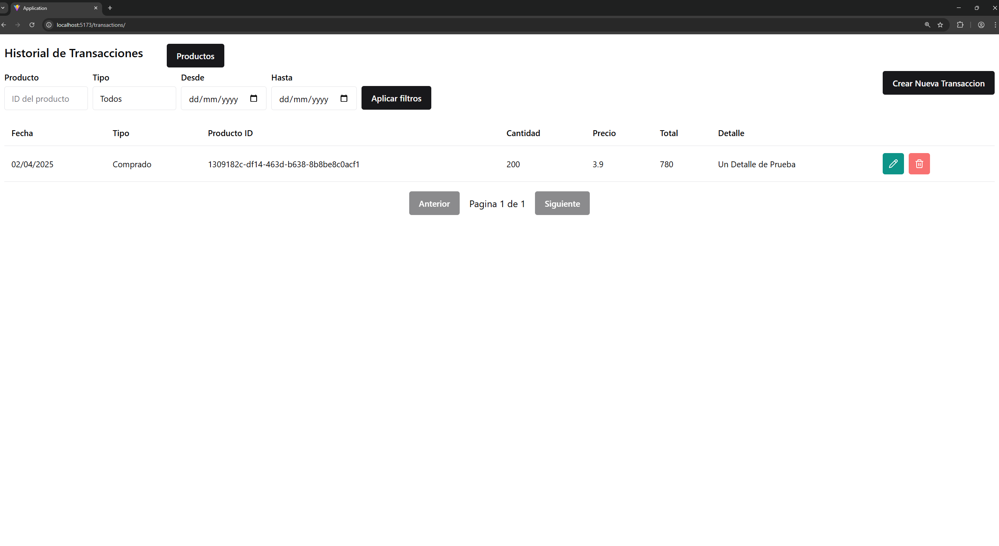
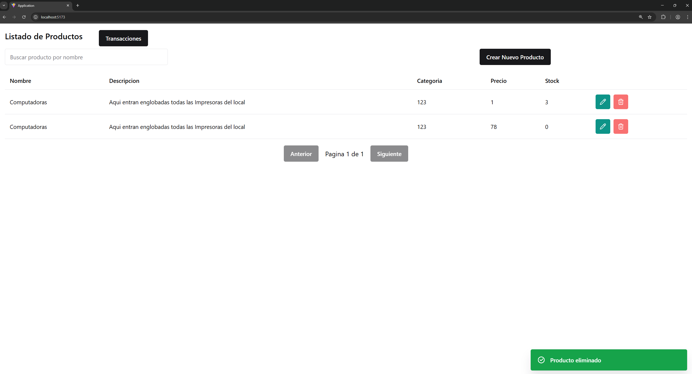
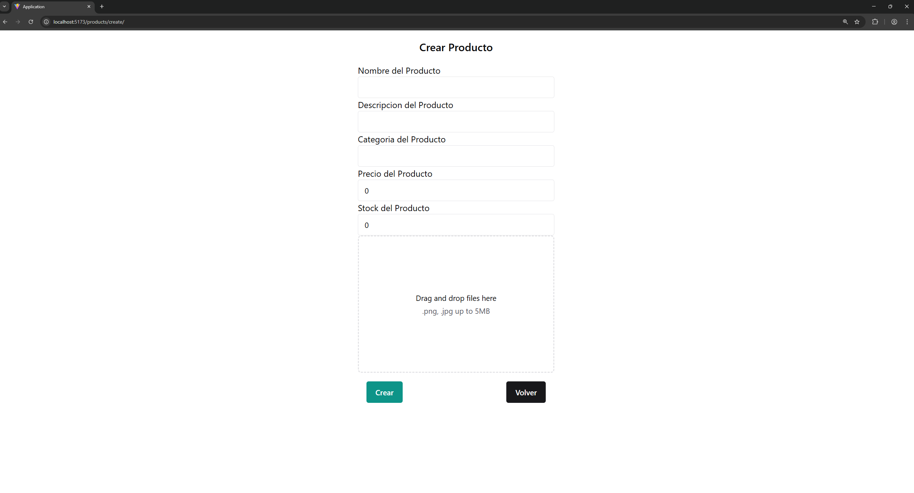
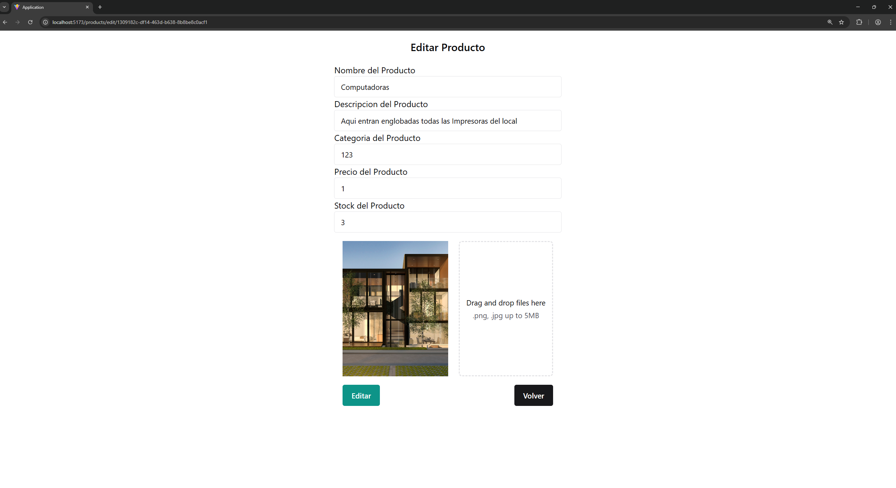
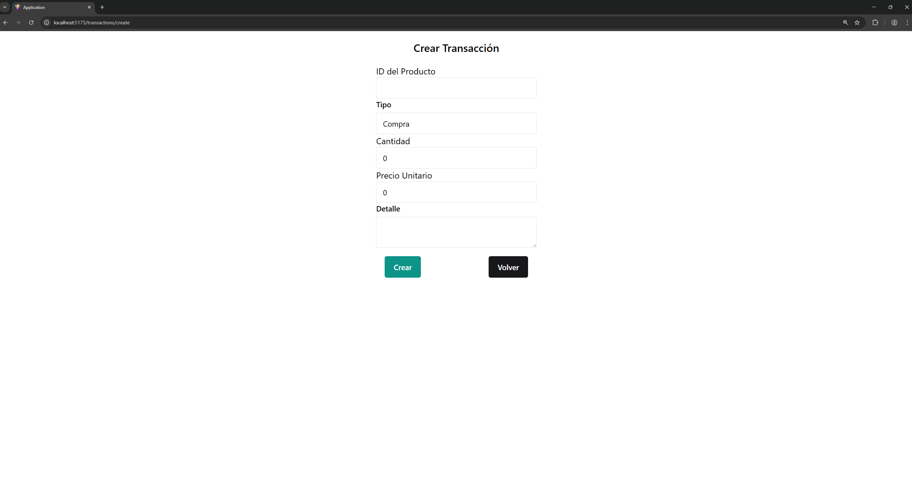
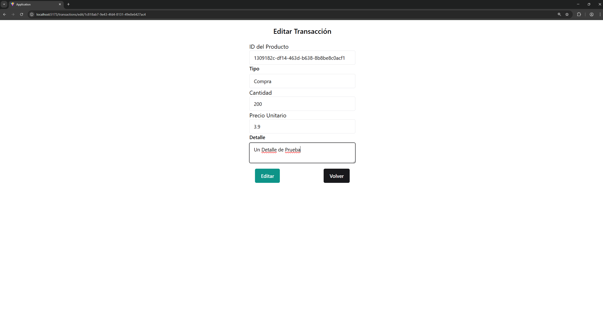

# Inventario App – Fullstack Microservicios

Este proyecto implementa una aplicación de gestión de productos y transacciones, desarrollado como evaluación técnica.

## 🧱 Arquitectura

- Backend con .NET 8 y Clean Architecture
  - Microservicio de Productos
  - Microservicio de Transacciones
- Frontend con React + Chakra UI + Vite
- Comunicación entre servicios vía HTTP REST
- Control de stock automatizado por microservicio de transacciones

---

## 🚀 Cómo correrlo localmente

### 🔧 Requisitos

- .NET 8 SDK
- Node.js (v18+)
- SQL Server (o SQLite para pruebas)
- Visual Studio / VS Code

---

### ▶️ 1. Clonar y restaurar dependencias

```bash
git clone https://github.com/pozeydon-code/inventario-app.git
cd inventario-app
```

### ▶️ 2. Backend – Productos

Se debe cambiar las cadenas de conexion de la base de datos `API/appsettings.json` y se debe crear la carpeta wwwroot en la carpeta API de ProductService

```bash
cd backend/ProductsService
dotnet restore
dotnet ef database update --p Infrastructure --s API
dotnet run --project API
```

### ▶️ 3. Backend – Transacciones

Se debe cambiar las cadenas de conexion de la base de datos `API/appsettings.json`

Se debe cambiar la url del archivo Infrastructure/DependencyInjection.cs con la dirección del mmicroservicio de productos

```bash
cd backend/TransactionsService
dotnet restore
dotnet ef database update --project Infrastructure --startup-project API
dotnet run --project API
```

### ▶️ 4. Frontend – React

```bash
cd frontend/react-app
npm install
npm run dev
```

Tambien puedes usar bun para un mejor rendimiento (recomendado)

```bash
cd frontend/react-app
bun install
bun run dev
```

---

## 📦 Estructura

```
inventario-app/
│
├── backend/
│   ├── ProductsService/
│   └── TransactionsService/
│
└── frontend/
    └── react-app/
```

---

## 📌 Notas

- El stock de los productos se actualiza automáticamente desde el microservicio de transacciones.

---

## 🌐 Configuración de CORS

Para permitir que el frontend acceda a los microservicios sin errores de CORS, puedes configurar los orígenes permitidos desde `appsettings.json` de cada microservicio.

### 📁 appsettings.json

```json
{
  "AllowedOrigins": ["http://localhost:5173"]
}
```

### 📁 DependencyInjection.cs (API)

```csharp
var allowedOrigins = configuration
    .GetSection("AllowedOrigins")
    .Get<string[]>();

services.AddCors(options =>
{
    options.AddPolicy("AllowLocalHost", policy =>
    {
        policy.WithOrigins(allowedOrigins!)
              .AllowAnyMethod()
              .AllowAnyHeader();
    });
});
```

### 📁 Program.cs (API)

```csharp
app.UseCors("AllowLocalHost");
```

## 🌐 Configuración de URL Microservicios

Para permitir que el servicio de transacciones acceda al microservicio de productos sin errores, puedes configurar la url desde `appsettings.json` de Transacciones.

### 📁 appsettings.json

```json
{
  "ProductsServiceUrl": "http://localhost:5106/"
}
```

---

## 🔁 Configuración de URLs del Frontend

Las URL base para consumir los microservicios desde el frontend están centralizadas en:

```
frontend/react-app/src/api/url.ts
```

Desde ahí puedes cambiar fácilmente las rutas hacia los microservicios de productos o transacciones según el entorno en el que se despliegue.

```ts
// url.ts
export const BASE_PRODUCT_API = 'http://localhost:5106/api';
export const BASE_TRANSACTION_API = 'http://localhost:5107/api';
```

Esto facilita mantener y modificar las rutas sin tener que buscarlas en cada componente.

---

## 🗃️ Uso del script SQL (alternativa a migraciones)

Si prefieres no usar migraciones de Entity Framework, puedes crear la base de datos manualmente ejecutando el script ubicado en:

```
/database/init_inventario_final.sql
```

### Cómo ejecutarlo:

1. Abre SQL Server Management Studio (SSMS) o Azure Data Studio.
2. Ejecuta todo el contenido del script para crear la base de datos `inventarioApp`, sus tablas y los 15 productos.
3. Luego puedes agregar manualmente algunas transacciones usando los IDs generados en la tabla `Products`.

> 💡 Este método es útil para probar rápidamente la aplicación sin necesidad de migrar desde código.

---

## 📸 Evidencias del sistema

### 🧾 Listado de productos



### 🧾 Listado de transacciones



### ➕ Pantalla para creación de productos



### ✏️ Pantalla para edición de productos



### ➕ Pantalla para creación de transacciones



### ✏️ Pantalla para edición de transacciones



## ✨ Autor

Desarrollado por Francisco Herrera – Evaluación técnica
